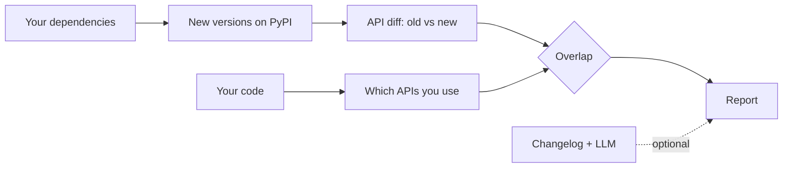

<div align="center">

# BUMPSCOPE

**See which dependency updates actually affect your Python code, before you upgrade.**

[](LICENSE)
[](pyproject.toml)
[](#roadmap)

</div>

> [!WARNING]
> This project is in early development and is not usable yet. Follow the [roadmap](#roadmap) for progress.

## Why

Update bots tell you a new version exists. Changelogs tell you what changed. Neither tells you whether the change touches *your* code.

So you either read every changelog, or you upgrade and hope the tests catch it.

`bumpscope` compares what a library changed with what your project actually uses, and reports only the overlap.

## Example

Illustrative output, showing the planned interface:

```text
$ bumpscope check

14 updates available

AFFECTS YOUR CODE (2)
  pydantic 1.10.13 -> 2.9.0
    src/app/models.py:14    @validator is deprecated, use @field_validator
  httpx 0.24.1 -> 0.28.0
    src/app/client.py:31    'proxies' argument was removed

SAFE TO UPGRADE (12)
  rich, click, pytest, ...
```

## How it works



## Principles

- **Read-only.** bumpscope never edits your code or your dependency files. It reports, you decide.
- **Static analysis first.** The core works without any AI. An LLM is optional and only adds what static analysis cannot see, such as behavior changes described in a changelog.
- **Measured, not claimed.** Accuracy will be reported on real dependency update pull requests from open-source projects.

## Roadmap

- [ ] **v0.1** CLI for a single package, report in the terminal
- [ ] **v0.2** All project dependencies, Markdown report
- [ ] **v0.3** Scheduled runs and chat notifications
- [ ] **v0.4** Accuracy measured on real update pull requests

## Related projects

- [griffe](https://github.com/mkdocstrings/griffe) detects API changes between versions of a Python package. bumpscope builds on this idea.
- [Codeshift](https://pypi.org/project/codeshift/) rewrites your code to match a new version. bumpscope only reports.
- [BreakRank](https://github.com/breakrank-dev/BreakRank) ranks breaking changes by how much they matter across the ecosystem. bumpscope looks at one specific codebase: yours.

## Contributing

Issues and pull requests are welcome. For larger changes, please open an issue first to discuss the idea.

## License

[MIT](LICENSE)