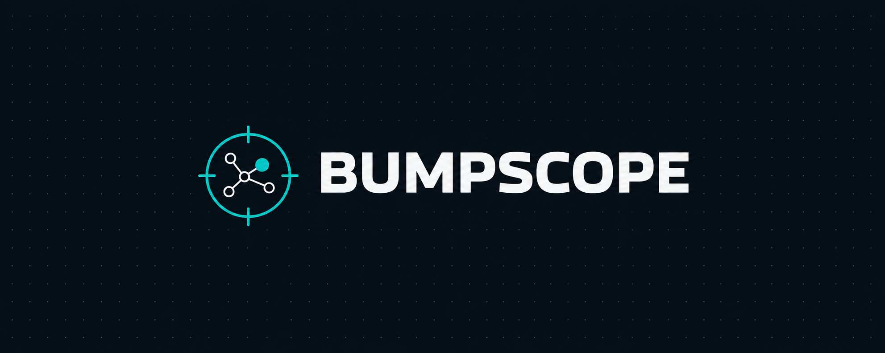
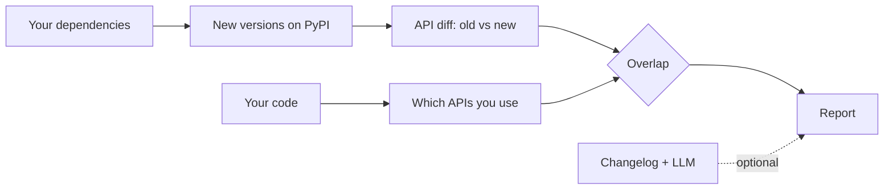

<div align="center">



**See which dependency updates actually affect your Python code, before you upgrade.**

[](https://github.com/Soulrom/bumpscope/actions/workflows/ci.yml)
[](LICENSE)
[](pyproject.toml)
[](#roadmap)

</div>

> [!WARNING]
> This project is in early development. `check` works for one package at a time, and has [known limitations](#limitations). Follow the [roadmap](#roadmap) for progress.

## Why

Update bots tell you a new version exists. Changelogs tell you what changed. Neither tells you whether the change touches *your* code.

So you either read every changelog, or you upgrade and hope the tests catch it.

`bumpscope` compares what a library changed with what your project actually uses, and reports only the overlap.

## What works today

```bash
git clone https://github.com/Soulrom/bumpscope.git
cd bumpscope
uv sync
```

### `check`: what an update breaks in your code

`bumpscope check` takes one package, finds the version installed in your project's `.venv`, compares it with the latest release on PyPI, and reports the places in your code that the breaking changes touch.

```bash
uv run bumpscope check httpx --project path/to/your/project
```

Real output, for a project that calls `httpx.Client(proxies=...)`:

```text
httpx 0.24.1 -> 0.28.0

PARAMETER WAS REMOVED
  app/client.py:5  httpx.Client(proxies)

1 impact from 29 breaking changes (method calls on instances are not analyzed)
```

Use `--from` and `--to` to choose the versions yourself, for example when the project has no `.venv`. When nothing matches, `check` says so, never that the update is safe: see [limitations](#limitations).

Exit codes, for scripts and CI: `0` nothing found, `1` impacts found, `2` error.

### `diff`: every breaking change between two versions

`bumpscope diff` shows the breaking API changes between two versions of a package. It downloads both versions from PyPI and compares them statically, without installing or running them.

```bash
uv run bumpscope diff httpx 0.24.1 0.28.0
```

Real output, shortened:

```text
httpx 0.24.1 -> 0.28.0

PARAMETER WAS REMOVED
  httpx.Client(app)
  httpx.Client(proxies)
  httpx.get(cert)
  httpx.get(proxies)
  ...

POSITIONAL PARAMETER WAS MOVED
  httpx.create_ssl_context(cert)
  httpx.create_ssl_context(verify)

29 breaking changes
```

## Where this is going

Today `check` looks at one package. The goal is to check every dependency of your project in one run. Planned interface, not implemented yet:

```text
$ bumpscope check

14 updates available

AFFECTS YOUR CODE (1)
  httpx 0.24.1 -> 0.28.0
    src/app/client.py:31    'proxies' argument was removed
    tests/conftest.py:12    'app' argument was removed

NO IMPACT FOUND (13)
  rich, click, pytest, ...
```

## How it works



## Principles

- **Read-only.** bumpscope never edits your code or your dependency files. It reports, you decide.
- **Static analysis first.** The core works without any AI. An LLM is optional and only adds what static analysis cannot see, such as behavior changes described in a changelog.
- **Measured, not claimed.** Accuracy will be reported on real dependency update pull requests from open-source projects.

## Limitations

- **Method calls on instances are not analyzed.** bumpscope follows names you import, such as `httpx.get(...)` or `Client(...)`, but not calls on objects, such as `c = httpx.Client(); c.get(...)`. It can miss impacts, so "no impact found" never means an update is safe.
- **Only breaking API changes are detected.** Deprecations and behavior changes that keep the same signatures are not reported.

## Roadmap

- [x] **v0.1** CLI for a single package, report in the terminal
- [ ] **v0.2** All project dependencies, Markdown report
- [ ] **v0.3** Scheduled runs and chat notifications
- [ ] **v0.4** Accuracy measured on real update pull requests

## Related projects

- [griffe](https://github.com/mkdocstrings/griffe) detects API changes between versions of a Python package. bumpscope builds on this idea.
- [Codeshift](https://pypi.org/project/codeshift/) rewrites your code to match a new version. bumpscope only reports.
- [BreakRank](https://github.com/breakrank-dev/BreakRank) ranks breaking changes by how much they matter across the ecosystem. bumpscope looks at one specific codebase: yours.

## Contributing

Issues and pull requests are welcome. For larger changes, please open an issue first to discuss the idea.

Before opening a pull request, run the same checks as CI:

```bash
uv run ruff check .
uv run ruff format --check .
uv run pytest
```

Tests run offline by default. Tests that download real packages from PyPI are marked `network`. Run them with `uv run pytest -m network`.

The domain terms are defined in [`CONTEXT.md`](CONTEXT.md), and the design of `check` is in [`docs/design/check-v0.1.md`](docs/design/check-v0.1.md).

## License

[MIT](LICENSE)